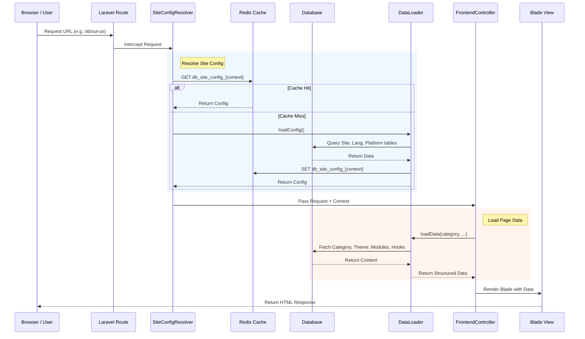
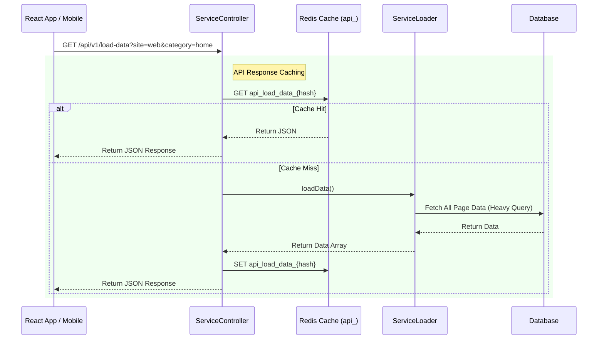

# Architecture Overview

HashtagCMS is built on top of the Laravel framework, leveraging its robust features while adding a specialized layer for content management. It follows a modular, service-oriented architecture designed for flexibility and performance.

## System Layers

### 1. The Core Layer (`src/Core`)
This is the brain of the CMS. It handles:
- **Module Loading**: determining which modules to load based on the request.
- **Layout Management**: converting database configurations into Blade views.
- **Traits & Helpers**: shared functionality used across the system.
- **Middleware**: intercepting requests to set up context (Site, Lang, Platform).

### 2. The Data Layer (`src/Models`)
HashtagCMS extends Eloquent models to add CMS-specific features:
- **AdminBaseModel**: Automatically handles `insert_by`, `update_by`, and audit logging.
- **BaseModel**: Provides read-only access for frontend to prevent accidental modification.
- **LangScopes**: automatically filtering content by the current language.
- **SiteScopes**: ensuring data is strictly isolated between sites in a multi-tenant setup.

### 3. The Controller Layer (`src/Http/Controllers`)
- **Admin Controllers**: Handle CRUD operations for the backend.
- **Frontend Controller**: The `FrontendController` is distinct—it acts as a "Router". It catches all URLs, looks up the database to find the matching Page/Category, loads the Layout, and dispatches the Modules.

## Key Design Patterns

### Service-Oriented Modules
Instead of monolithic controllers, HashtagCMS uses "Service Modules". A module is a self-contained unit (Model + View + Controller logic) that can be reused anywhere.

### Context-Awareness
Every request passes through a discovery phase where the system identifies:
1.  **Site**: Based on domain name.
2.  **Platform**: Based on User-Agent (exist in url /web|/pwa etc) or API parameter. 
3.  **Language**: Based on URL prefix (exist in url /web|/pwa etc).

This "Context" is then injected into the service container and is available globally via helpers like `htcms_get_site_id()`.

### The "Everything is a Module" Philosophy
Unlike traditional CMSs where "Header" or "Menu" might be hardcoded, in HashtagCMS, **everything** is a module.
- The Menu is a module.
- The Hero Banner is a module.
- The Footer is a module.
- Even the Main Content area is just a big module.

This allows for extreme flexibility. You can move the "Main Content" to the sidebar, or put the "Menu" in the footer, just by changing the assignment in the Admin Panel.

## Request Lifecycle

1.  **Incoming Request** hits `routes/web.php`.
2.  **Middleware** (`Interceptor`) determines Site/Platform/Lang.
3.  **FrontendController** receives the request.
4.  **InfoLoader** fetches the Page metadata from the DB.
5.  **LayoutManager** determines which "Skeleton" (Blade View) to use.
6.  **ModuleLoader** finds all modules assigned to this Page's "Hooks".
7.  **Data Processing**: Each module's data is fetched (SQL/API).
8.  **Rendering**:
    - If `Web`: Blade views are compiled with data injected.
    - If `API`: Data is serialized to JSON.
9.  **Response** is sent to the user.

# Request Workflow

This section explains what happens when a user accesses a URL in the browser (Monolithic / Internal flow) or when a client consumes the API.

## Monolithic / Internal Workflow
This flow is used when HashtagCMS is serving the frontend directly (Laravel Blade Views).



## External API / Headless Workflow
This flow is used when a separate frontend (React/Next.js/Mobile) requests data.


```

## Caching Strategy Legend

### 1. Prefixes
*   **`db_`**: Internal monolithic cache (Source: Local MySQL). managed by `RedisCacheManager::getDatabasePrefix()`.
*   **`ex_`**: Internal headless consumer cache (Source: Remote API). managed by `RedisCacheManager::getExternalSourcePrefix()`.
*   **`api_`**: Public API response cache (Source: Local Logic -> JSON). managed by `RedisCacheManager::getApiPrefix()`.

### 2. Toggles
*   **`HASHTAGCMS_ENABLE_CACHE`**: Master switch for internal `db_` and `ex_` caching.
*   **`HASHTAGCMS_API_CACHE_ENABLED`**: Master switch for public `api_` caching.
