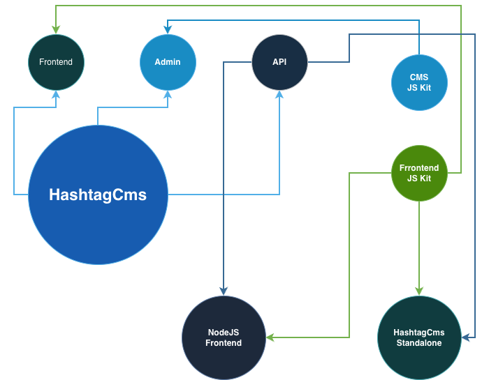

# HashtagCMS

[](https://packagist.org/packages/hashtagcms/hashtagcms)
[](https://packagist.org/packages/hashtagcms/hashtagcms)
[](https://packagist.org/packages/hashtagcms/hashtagcms)

HashtagCMS is a powerful, headless-ready, and module-based Content Management System built on Laravel. It separates the "Frontend/Headless" logic from the "Backend/Admin" logic, allowing you to manage multiple sites, platforms (Web, Mobile), and languages from a single installation.

## Key Features

-   **Multi-Tenancy**: Manage multiple sites from one admin panel.
-   **Headless Ready**: Robust API for consuming content on React/Vue/Mobile.
-   **Everything is a Module**: drag-and-drop module placement for any part of the page.
-   **Smart Queries**: Fetch data from SQL using JSON configuration (no code needed).
-   **Extensible Admin**: Flexible view resolution supporting custom packages and theme overrides.
-   **Premium Features**: MongoDB support, (SSO, and Figma Integration (coming soon)).

### Modular Admin Architecture
HashtagCMS supports a fully modular admin panel. You can easily integrate external packages (like HashtagCMS Pro) or override standard CRUD views directly from the database configuration, enabling seamless upgrades and customization.

### HashtagCMS ecosystem
HashtagCMS is a part of HashtagCMS ecosystem. It is a collection of packages that can be used to build a website, app, or any other type of application.



## Documentation

We have comprehensive documentation available in the `docs/` directory.

-   [**Start Here: Documentation Index**](docs/00-index.md)
-   [Installation Guide](docs/02-installation.md)
-   [Quick Start](docs/03-quick-start.md)
-   [API Reference](docs/13-api-headless.md)
-   [Feature List](docs/features.md)

## Installation

Via Composer

```bash
composer create-project hashtagcms/create-app my-awesome-site
cd my-awesome-site
php artisan cms:install
```

And done :)


Or 
``` bash
composer create-project laravel/laravel my-aswesome-site
cd my-aswesome-site
composer require hashtagcms/hashtagcms 
php artisan cms:install
```

## Hashtag CMS installation guidelines

- Open `.env` file and update `APP_URL`, and make sure database information is correct.

``` bash 
DB_CONNECTION=mysql
DB_HOST=127.0.0.1
DB_PORT=3306
DB_DATABASE=
DB_USERNAME=
DB_PASSWORD=
```

- Open `app/Models/User.php` and remove or comment below lines.

``` bash
// use Illuminate\Foundation\Auth\User as Authenticatable
```
- ##Add below## lines in the same file (`app/Models/User.php`)
``` bash
use HashtagCms\User as Authenticatable;
```
- You might want to comment/remove below route in `routes/web.php`

```bash 
/*Route::get('/', function () {
    return view('welcome');
});*/
```

### Configure site on browser. Open it with the appUrl prefix
```bash 
http://{APP_URL}/install
ie:
http://www.hashtagcms.org/install
```

- You are done :)


After installation, visit:
-   **Frontend**: `http://your-domain.com`
-   **Admin**: `http://your-domain.com/admin`

## Testing

```bash
php artisan test vendor/hashtagcms/hashtagcms
```

## Contributing

Contributions are welcome! Please see [contributing.md](contributing.md) for details.

## Changelog 
- [Changelog](changelog.md)

## License  

The core of HashtagCMS is open-sourced software licensed under the [MIT license](https://opensource.org/licenses/MIT).
Premium features (MongoDB, SSO) require a commercial license. See [Licensing](docs/18-licensing.md).
